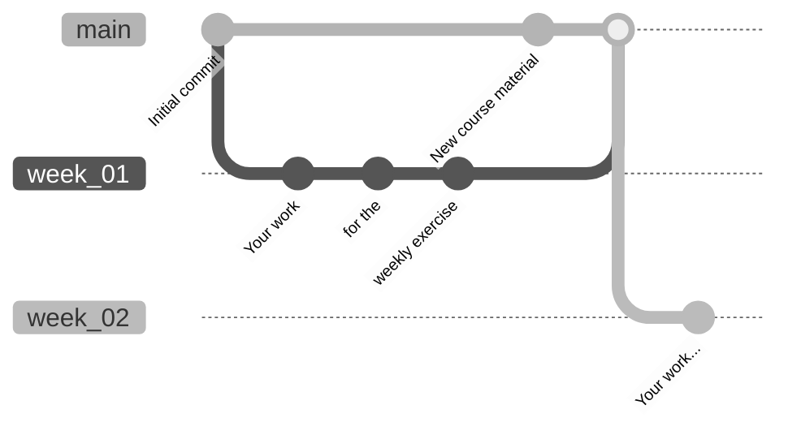

# Data Analytics

Repository of the Data Analytics module at ZHAW.

> ℹ️ **NOTICE:** Please note that the weekly material will always be available shortly before the course starts.

## Getting Started

### GitHub Codespaces

Click the green button above and create a code space. Everything should be set up as needed.

### Locally

Assuming you have

- [Visual Studio Code](https://code.visualstudio.com/Download)
- [git](https://github.com/git-guides/install-git)
- [Python3](https://www.python.org/downloads/)
- [Created a fork](https://github.com/mario-gellrich-zhaw/data_analytics/fork) of this repository and [set up an SSH key](https://docs.github.com/en/github-ae@latest/authentication/connecting-to-github-with-ssh/adding-a-new-ssh-key-to-your-github-account)

you can clone this repository to your computer using:

```
git clone <repository-url>
```

where `<repository-url>` is the url of your fork (click green button above, Local, SSH).

After that, run:

```bash
cd data_analytics                # go to the working directory
pip install -r requirements.txt  # installs all python requirements
```

## Folder Structure

Once the course is complete, the folder structure will look like this:

```
Data Analytics
├── .devcontainer
│   └── .devcontainer.json
├── Week_01
│   ├── ...
├── Week_02
│   ├── ...
├── Week_03
│   ├── ...
├── Week_04
│   ├── ...
├── Week_05
│   ├── ...
├── Week_06
│   ├── ...
├── Week_07
│   ├── ...
├── Week_08
│   ├── ...
├── Week_09
│   ├── ...
├── Week_10
│   ├── ...
├── Week_11
│   ├── ...
├── Week_12
│   ├── ...
├── Week_13
│   ├── ...
├── Week_14
│   ├── ...
├── .gitignore
├── README.md
└── requirements.txt
```

## Useful git commands 

Before running these commands, make sure you're in your working directory.
This is usually the case when you work with the integrated terminal of Visual Studio Code (and Devcontainers).

If not, use this command:

```bash
cd U:\Lektionen\DA_HS2023\data_analytics  # your working directory
```

### Clear git cache

```bash
git rm -r --cached .
git rm -r --cached ./foldername
git rm --cached <filename>
```

### Rebase

Rebase local changes on top of changes from the remote repository.

```bash
git config pull.rebase true  # run this once for working directory
git pull --tags origin main  # updates codebase
```

### Force Push and Pull to/from remote repository

```bash
git push --force
git pull --force
```

### Branching

```bash
git checkout -b week_01  # creates and changes to the new branch 'week_01'
git checkout main        # returns to main branch
```

For example, you could manage your branches like this:



Check out the Git Book on [Basic Branching and Merging](https://git-scm.com/book/en/v2/Git-Branching-Basic-Branching-and-Merging).